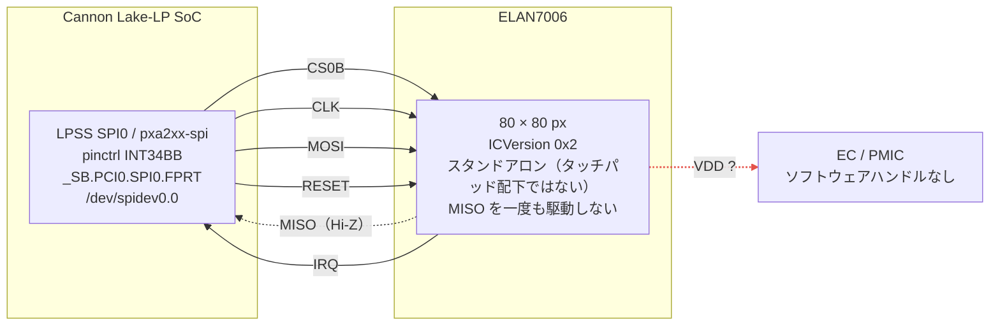
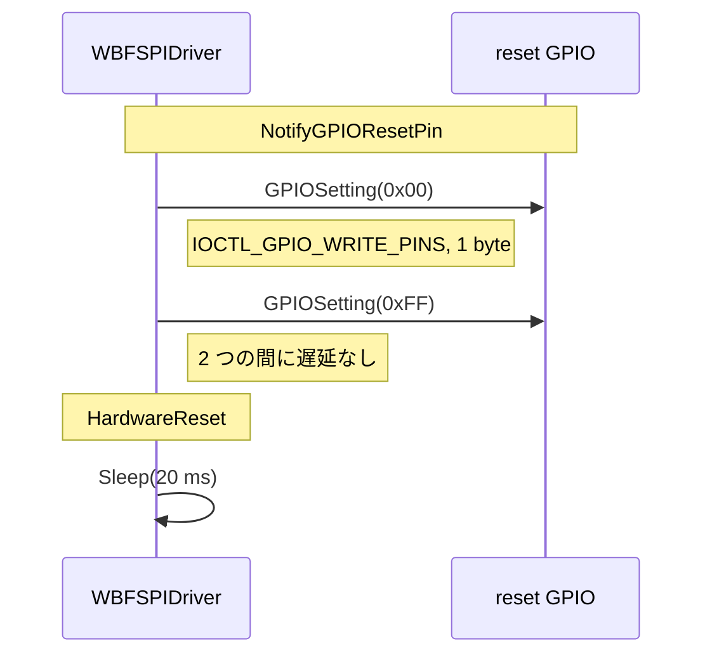

ASUS ExpertBook B9450 に載っている ELAN7006 指紋センサーを Linux から動かそうとして、4日間潰しました。結論だけ先に書くと **これはドライバの問題ではなく、両OSともソフトウェアからは触れないハードウェアの状態の問題** です。同じことを繰り返す人が出ないように、消去した仮説を全部残しておきます。

環境は以下の通りです。

- パーツ: ELAN7006（スタンドアロン SPI 接続、タッチパッド配下ではない）
- マシン: ASUS ExpertBook B9450
- カーネル: 7.0.0-31-generic
- 期間: 2026-09-09 〜 09-10

## 結論

**Windows のドライバが最初の SPI リードを発行した時点で、センサーはすでに応答可能な状態になっています。** Windows はそのリードが成功する前に、初期化シーケンスもリセットパルスも電源投入ステップも一切実行していません。

一方 Linux では、コントローラ・チップセレクト・クロック・pinmux のレベルまで正しいと確認済みの同じバスが、すべての転送で `0xFF` を返します。

差分は **どちらのドライバが走るよりも前に確立されているボードの状態** にあります。EC もしくは PMIC の内側でゲートされているレール、どちらのOSからもソフトウェアハンドルの存在しないレールです。`FPRT` には `_PSx` も power resource もなく、Linux の regulator もなく、EC-RAM のビットもなく、Windows ドライバの中にも電源に触れるコードパスがありません。

これはドライバの問題ではなく、どちらのOSでこれ以上トレースを取っても、存在しないハンドルは出てきません。

**ステータス: 解析ではなくハードウェア計測待ちでブロック中。**

## 0xFF という定数

一度も変化しなかった値です。正常なセンサーは SPIStatus から `0x81`、height/width レジスタから `0x50` を返します。ステータス・64本の全レジスタ・画像データのすべてのリードで `0xFF` が返るのは、**MISO がハイに浮いている（スレーブがラインを一切駆動していない）** ときの教科書通りのシグネチャです。

以下をスイープしても `0xFF` は変わりませんでした。

| スイープした条件 | 結果 |
|---|---|
| 4 つの SPI モード × 1/2/4/8 MHz | 全組み合わせで `0xFF` |
| リセットパルス、両極性（line 271） | `0xFF` |
| SPI ソフトウェアリセット `0x31` | `0xFF` |
| コールドブートとウォームリブート | 両方 `0xFF` |
| enable ラインをブートから保持 | ベースライン含めて `0xFF` |
| settle 50/200/1000 ms × post-reset 20/100/500 ms | 9点すべて `0xFF` |

## トポロジ

SoC が制御するラインはすべて正しく（CS0B / CLK / MOSI / MISO / RESET / IRQ の 6 本すべて Linux から確認済み）、すべての転送は完了します。スレーブが MISO を駆動しないだけです。ソフトウェアから到達できない経路は破線の1本だけです。

## ハードウェアの事実

| 項目 | 内容 |
|---|---|
| `\_SB.PCI0.SPI0.FPRT` | ACPI ノード `spi-ELAN7006:00`。spidev に `/dev/spidev0.0` としてバインドされるが、手動の `driver_override` バインドが必要。 |
| `_HID`（計算値） | `(TPDI & 0x24) == 0x24` のとき `ELAN7001`、それ以外は `ELAN7006` を返す。`TPDI` は BIOS が ACPI NVS に書き込む。ここではビット `0x20` がクリアなので、このセンサーは指紋 in タッチパッドではなくスタンドアロン。 |
| `_CRS` SPI descriptor | Mode 0、CS active-low、4線式、8ビット、`ControllerInitiated`。宣言上は 1 MHz だが、`SPEX = 0x00B71B00` が 12 MHz に書き換える。 |
| Reset GPIO | `GNUM(0x0402000F)` = GPP_C15 = pinctrl pin 196 = `gpiochip0` line 271。`GpioIo` に active-level フィールドがないので、変換すべき ACPI 極性は存在しない。 |
| Interrupt GPIO | `GNUM(0x04030010)` = GPP_D16 = pin 84 = line 112。finger-present IRQ であってリセットではない。 |
| `_STA` | 無条件で `0x0F` を返す（実質 `Return (Zero)` の死んだコード）。ここでは ACPI presence は何も証明しない。 |
| Power | `FPRT` に `_PSx` なし、power resource なし、Linux regulator なし。`FPRT` は DSDT の他のどこからも参照されていない。 |

## Windows は実際に何をしているか

ドライバは `WBFSPIDriver.dll`（UMDF2、package v4.5.13001.11903、file v3.23.0.97）。`oem23.inf` が `UmdfHostProcessSharing=ProcessSharingDisabled` でインストールするので、専用の `WUDFHost.exe` を持ちます。リリースビルドが `DbgPrintEx` のトレース文字列を全部残しているので、以下の関数名はドライバ自身のものです。

`ResetType = 2 = RESET_TYPE_GPIO` での「ハードウェアリセット」の全体は3操作だけです。

その後 `FpDeviceInitialize` がレジスタ `0x08`（height）と `0x09`（width）を読み、`0x50` を期待します。全部 `0xFF` だと `HardwareReset` から約5回リトライし、`"Cannot find appropriate Sensor size"` をログして諦めます。**電源レールのステップも、2つ目の GPIO も、最初のリードより前の SPI ライトも存在しません。**

### ブリングアップトレース

`logman` で `pnputil /restart-device` サイクルをキャプチャしました。古いホストが DLL を落とし、新しいホストが立ち上げるのを見て本物だと確認しています。

| 計測項目 | 値 |
|---|---|
| SPI アクティビティ窓 | +108.6 ms → +273.0 ms（164 ms） |
| FP ホストからの SPB リクエスト | 596（うち 588 が full-duplex） |
| 1バイト SPB ライト | 8 — すべて `SoftwareReset`（`0x31`）、12〜14 ms 間隔 |
| reset ライン（line 271）への GPIO 操作 | **0** |
| interrupt ラインへの GPIO 操作 | 8 |
| WinBio / Biometrics イベント | 0 — 一度も関与せず |
| retry-then-abort シグネチャ | 検出されず |
| 終了シーケンス | last SPI +273.0 → IRQ armed +273.5 → host settles +274.6 |

init、キャリブレーションバースト、interrupt armed、完了まで、**reset GPIO を一度もパルスせずに** 到達しています。Windows が発行した唯一のリセットは SPI の `0x31` で、これは Linux のプロトタイプがすでに送っているものです。

## 消去法の台帳

### Windows 側で消したもの

| 仮説 | 消去した根拠 |
|---|---|
| SPI の init / コマンドシーケンスが足りない | Windows は最初の成功リードの前に何も発行していない |
| GPIO リセットパルスが wake を担っている | ブリングアップトレース全体で line 271 への操作が0 |
| ドライバ内の電源ステップ | 逆アセンブルのどこにも存在しない。`FPRT` に `_PSx` / power resource なし |
| ASUS WMI の指紋電源コール | WMI クライアントなし。`ELANFPService.exe` / `WbfSpiDriver.dll` の import table に `ROOT\WMI` / `TBFP` / `WMTF` の参照なし |
| EC-RAM の状態 | 4回のダンプがバイト単位で一致、全ペアで `cmp -l` が空 |

### Linux 側で消したもの

| 仮説 | 消去した根拠 |
|---|---|
| タッチパッド経由の HID feature-report リセット | `TP_PID = 0xFFFF` かつスタンドアロンセンサー。report `0xE` の経路が届かない（libfprint のプロトタイプが試みたのはこれ） |
| SPI モードかクロックが間違っている | 4モード × 1/2/4/8 MHz、全組み合わせで `0xFF` |
| ioctl が失敗している | バイト数を確認、`ioctl=3 ok`、受信バッファを先に `0xAA` で汚染して stale buffer と本物のリードを区別 |
| pinmux — SPI ピンが GPIO として park されている | `spi0_grp` pins 40–43 が `mode 1`（native SPI0） |
| チップセレクトがアサートされていない | CS0B（pin 40）が `mode 1`、コントローラ所有、GPIO ではない |
| reset パッドの状態が違う | pad 196 が GPIO mode、TX enabled、deassert 保持。`[LOCKED]` でも `PADCFG0` はライトを追従する |
| リセットパルス、どちらの極性でも | line 271 に直接両極性を試した。変化なし |
| SPI ソフトウェアリセット | プロトタイプは Windows と同じく `0x31` を送る。それでも `0xFF` |
| enable ラインをブート初期にアサート | spidev バインド前にブートから保持し、settle × post-reset スイープ（50/200/1000 ms × 20/100/500 ms）。ベースライン含め全点 `0xff` |
| SPI ではなく USB センサーだった | USB 上に指紋らしきものは何もない |

## 決定的な実験 — ウォームハンドオフ

コールドブートで Linux → プローブ。Windows を起動し、リーダーに触れて **実際に認証が通ることを確認**。電源を一切切らずウォームリブート（`reboot`）で直接 Linux に戻る → 再度プローブ。両条件で、各プローブの前後に EC ダンプを計4回取得しました。

結果: 両ブートとも4モード × 1〜8 MHz すべてで `0xFF`（uptime 195 s / 68 s）。EC ダンプ4つは **バイト単位で一致**。GSPI0 と reset パッドも不変。

**つまり Windows が確立するものは、電源断のないウォームハンドオフを跨いでも Linux に持ち越されず、その在り処は EC 自身の RAM でもありません。** この1つの結果で EC 関連の調査ライン全体が閉じました。

副次的な発見として、SPI プローブは EC を摂動させないことも示せました（両条件で `*-boot` == `*-postprobe`）。

## 残された道

**ロジックアナライザによるキャプチャ** です。SPI 4本 + reset + GPP_C10 を取り、正常な Windows ブートと Linux ブートを比較して、差分の出る正確なエッジもしくはレールを特定します。

FX2 クローンと sigrok/PulseView で £10〜15 程度。障害は計測器ではなく、筐体内の fine-pitch な FPC リボンです。これより安い手段はすべて試しました。

## 引用時に落としてはいけない注意点

1. **SPB の ETW はペイロードバイトをログしません。**「最初のリードが `0x50` を返した」はコントロールフロー（リトライループがなく、IRQ arming までクリーンに進む）からの推論であって、直接観測したものではありません。推論は強いですが推論です。
2. **reset-GPIO イベントが無いことは、resource-hub の `IOCTL_GPIO_WRITE_PINS` に対するトレースのギャップである可能性** があり、真の不在とは限りません。ただし結論は変わりません。どちらにせよその両極性は Linux で試しています。

## 同じことを繰り返すなら

- **`Get-WinEvent`**: `-FilterHashtable` 内の `StartTime` / `EndTime` は `.etl` ファイルに対して黙って no-op します。フィルタもエラーも出さず、クエリが何も返さないだけで「その窓にイベントがない」ように見え、偽の手掛かりに誘導されます。`Where-Object` で `ProcessId` フィルタする方が確実です。
- **`tracerpt`**: ETL に対する `ProviderName` の解決は不安定です。`tracerpt` が GUID で 28 件・186 件をデコードした2つのプロバイダに対し、`Get-WinEvent` は0件を返しました。結論を出す前に2ツール間でカウントをクロスチェックしてください。
- **SPB トレース**: バスはタッチパッドが支配します。I²C-HID タッチパッドがある run で 216,522 イベントを流しました。必ず指紋ドライバのホスト PID に絞ること。生の SPB 合計は無意味です。`Kernel-Power` も外す（451,175 イベント、全部ノイズ、あるキャプチャが 764 MB の XML に膨れた原因）。
- **`gpioinfo`**: ヘッダ行を1行出すので、chip line N はファイルの N+2 行目になります。pinctrl debugfs の `pins` ファイルを使う方がよく、GPIO 番号を `<gpio>:<chip>` の形で直接出してくれます。ACPI の `GNUM()` 結果を手計算せずに確認できます。
- **`pinctrl`**: Cannon Lake はパッドを native function 名で呼びます（`UART1_CTSB` であって `GPP_C15` ではない）。そのファイルで `GPP_*` を grep しても何も返らず、ピンが存在しないように見えます。
- **Device Manager**: このデバイスでは Disable が常にグレーアウトします。`CM_DEVCAP_REMOVABLE` がクリアの固定 ACPI 列挙パーツだからです。elevated shell から `pnputil /restart-device` を使うこと。1回の atomic な stop/start で、コマンドが死んでもセンサーが disable のまま残る窓がありません。

## アップストリームの状況

libfprint の MR !383 はまさにこのセンサーとタッチパッド PID を対象にしていましたが、マージされず close されました（draft が enroll も verify も一度もできなかった）。libfprint master はこのパーツをサポートしていません。gitlab.freedesktop.org は自動フェッチをブロックする（Anubis）ので、その MR はブラウザで読んでください。

このセンサーはベンダ INF に一級の install セクションを持つ、出荷済みのドキュメント化された構成です（`%DeviceName% = Biometric_Install_7006, ACPI\ELAN7006 ; For B9450`）。未知のハードウェアではありません。ただオープンソースドライバが存在せず、そしてこのボードでは、それを書く相手となる到達可能な電源ハンドルが存在しないだけです。
